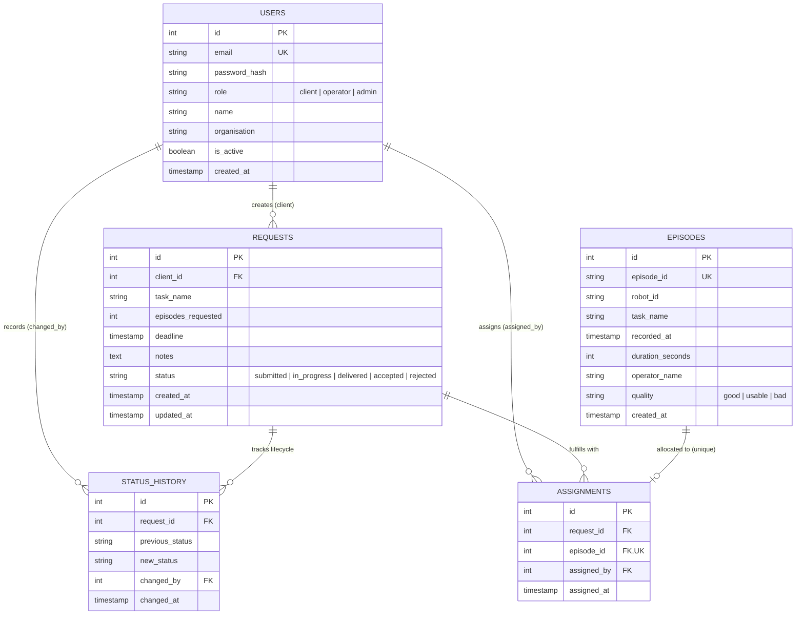

# Engineering Design Notes & Architectural Decisions

This document provides architectural reflections, design rationale, security analyses, and operational considerations for **Dataset Request Desk**.

---

## 1. System Design & Data Model

### 1.1 Data Model Architecture

The data model is implemented in PostgreSQL and managed with Alembic migrations:



### 1.2 Where State Lives
All state lives in the relational database (**PostgreSQL**) governed by ACID transaction boundaries. 
- The backend application is **completely stateless**: no local file storage, no in-memory session caches, and no sticky server sessions. Any backend replica can handle any API request.
- State changes (such as workflow status transitions or episode assignments) run inside explicit database transactions with row-level locks (`SELECT ... FOR UPDATE`) where necessary to prevent race conditions.
- Every workflow mutation inserts an immutable record into `status_history`. Rather than relying on a loose `updated_at` column, the full temporal provenance (who changed what, from which state, to which state, and at what exact microsecond) is preserved.

### 1.3 The 2–3 Hardest Decisions and Rationale

1. **Episode Assignment Exclusivity: Database Constraint vs. Soft State Flag**
   - *The Dilemma:* Should an episode's assignment status be tracked via a foreign key on the `episodes` table (`assigned_request_id`), a boolean flag (`is_assigned`), or a separate `assignments` join table?
   - *The Choice:* We implemented an explicit `assignments` table with a **unique constraint** on `episode_id` (`UNIQUE (episode_id)`).
   - *Why:* Storing a foreign key directly on `episodes` couples recording metadata with request fulfillment logic. More dangerously, checking availability with a boolean flag in application code invites race conditions (two operators assigning the same episode simultaneously). A dedicated join table with a unique database constraint guarantees at the engine level that an episode can belong to at most one request at any moment. Concurrency collisions fail cleanly with an integrity error.

2. **Server-Enforced State Machine vs. Generic CRUD Updates**
   - *The Dilemma:* Standard REST frameworks often encourage a generic `PATCH /api/requests/{id}` accepting any field update.
   - *The Choice:* Status changes are strictly isolated to a dedicated endpoint (`POST /api/requests/{id}/status`), processed through a domain transition validator (`update_request_status`), and accompanied by an automatic append-only log in `status_history`.
   - *Why:* In a multi-party system (clients vs. operators), allowing arbitrary status updates creates catastrophic edge cases (e.g., clients delivering their own requests, or operators marking requests delivered without meeting target episode counts). Isolating transitions to an explicit domain service guarantees that domain constraints—such as verifying `episodes_assigned >= episodes_requested` before transitioning to `delivered`—cannot be bypassed.

3. **In-Database Analytics Computation vs. Python DataFrames**
   - *The Dilemma:* Calculating the median delivery turnaround and daily robot throughput is trivial in Python using Pandas. However, doing so requires loading historical rows into application memory.
   - *The Choice:* All analytics computations are executed directly inside PostgreSQL using SQL window functions (`PERCENTILE_CONT(0.5) WITHIN GROUP (...)`) and date aggregations (`DATE_TRUNC('day', recorded_at)`).
   - *Why:* While writing raw SQL percentiles is more complex to test, it eliminates network serialization overhead and prevents Python out-of-memory crashes as the dataset grows into millions of episodes.

---

## 2. What Was Deliberately Left Out or Simplified (and Next Steps)

Given the 6–8 hour time budget, we focused on core domain correctness, rigorous authorization, and automated testing. The following items were simplified:

### Deliberate Simplifications
1. **Synchronous CSV Processing:** The CSV upload processes up to tens of thousands of rows synchronously in the request thread. For files with millions of rows, this should be offloaded to an asynchronous background worker.
2. **Simplified Refresh Token Lifecycle:** Authentication uses signed JWT bearer tokens with a 24-hour expiration window rather than a dual-token (short-lived access + sliding refresh token) architecture.
3. **No File Binary Blob Storage:** Episodes are metadata records only; raw teleoperation video recordings (`.mp4`) and sensor bags (`.mcap` / `.rosbag`) are referenced by identifier rather than stored in an S3-compatible object store.

### What We Would Build With Two More Days
1. **Background Job Queue (Celery / ARQ + Redis):**
   - Offload large CSV imports to an asynchronous worker queue with progress polling or WebSocket updates.
   - Implement the optional stretch item: an automated simulated export job for newly assigned episodes that runs asynchronously, retries on failure, and surfaces status badges in the UI.
2. **Real-Time Notification Pipeline (Server-Sent Events / WebSockets):**
   - Push request status transitions and newly created requests to operator dashboards in real-time without requiring manual polling or page refreshes.
3. **Batch Episode Assignment:**
   - Allow operators to multi-select 50+ episodes matching a task filter and assign them in a single bulk operation with atomic rollback.
4. **Client Organization Partitioning & RBAC Extension:**
   - Add multi-seat client accounts with an `organization_admin` role capable of inviting colleagues and viewing organization-wide dataset requests.

---

## 3. What Went Wrong During Development & How It Was Diagnosed

### The Bug: Median Duration Calculation in SQL
*Symptom:* During initial development of the analytics endpoint, the median turnaround query intermittently returned `NULL` or raised syntax errors in PostgreSQL when computing elapsed time from `submitted` to `delivered`.

*Diagnosis:*
1. Our first query draft attempted:
   ```sql
   PERCENTILE_CONT(0.5) WITHIN GROUP (ORDER BY delivered_at - submitted_at)
   ```
   In PostgreSQL, subtracting two `TIMESTAMP WITH TIME ZONE` columns yields an `INTERVAL` data type. However, PostgreSQL's `PERCENTILE_CONT(0.5)` function only operates on continuous numeric types (`FLOAT8`, `NUMERIC`), not directly on `INTERVAL`.
2. Furthermore, in cases where requests were rework-looped (`delivered` → `rejected` → `in_progress` → `delivered`), taking the absolute maximum timestamp vs. minimum timestamp yielded ambiguous durations.

*Resolution:*
We restructured the query to:
1. Extract the epoch seconds from the interval difference using `EXTRACT(EPOCH FROM ...)` before passing the values to `PERCENTILE_CONT(0.5)`.
2. Join on the earliest `submitted` timestamp (`MIN(changed_at)`) and earliest `delivered` timestamp (`MIN(changed_at)`), dividing the resulting median epoch seconds by `3600.0` to yield human-readable hours.
3. Wrapped this logic in automated integration tests (`test_analytics.py`) to verify behavior across diverse date ranges and empty states.

---

## 4. Security Architecture & Threat Analysis

### 4.1 Security Measures Implemented
- **Password Security:** Salted and hashed using `bcrypt` (work factor 12) via Passlib. Plaintext passwords are never stored, logged, or serialized.
- **Stateless Bearer Tokens:** Signed using `HS256` with secret keys loaded strictly from environment variables. Tokens encode user subject ID and role claims, validated on every request.
- **Strict Role Authorization:** All sensitive endpoints declare explicit FastAPI dependency checks (`get_current_user_payload` and role-specific assertions). Authorization is strictly enforced server-side; UI visibility toggles are cosmetic.
- **IDOR Protection:** Client endpoints enforce strict ownership checks:
  ```python
  if user_role == "client" and req.client_id != user_id:
      raise HTTPException(status.HTTP_404_NOT_FOUND, "Request not found")
  ```
  *(Note: A 404 is returned instead of 403 to prevent resource enumeration attacks).*
- **Input Validation:** All incoming payloads are validated against strict Pydantic v2 schemas with constrained string lengths, positive integer bounds, and enum validations.
- **SQL Injection Prevention:** 100% of queries use SQLAlchemy parameterized statements or bound text parameters.

### 4.2 Two Vulnerabilities We Would Worry About Most

1. **Insecure Direct Object Reference (IDOR) & Horizontal Privilege Escalation:**
   - *Risk:* In a multi-tenant client system, client A guessing request ID `#104` belonging to client B could inspect proprietary robotics task names, deadlines, or collection strategies.
   - *Mitigation:* We implemented tenant-level filtering directly in the database queries (`WHERE client_id = :user_id`) rather than filtering post-query in Python. For single-entity lookups, mismatched ownership returns `404 Not Found`.

2. **CSV Bomb / Resource Exhaustion via Malicious Uploads:**
   - *Risk:* An operator importing an unvalidated or multi-gigabyte CSV file could trigger a Denial of Service (DoS) by exhausting backend CPU and memory, locking database tables during unbounded inserts.
   - *Mitigation:* In production, we enforce a strict file size ceiling (e.g. 25 MB max payload), stream rows via chunked generator iterators, and wrap batch database insertions in transactions with reasonable statement timeouts.

---

## 5. Scaling Strategy: 10× Users & 100× Episodes (5M+ Records)

### 5.1 What Breaks First?
1. **Full-Table Scans on Episodes Table:** As `episodes` grows from 10,000 to 5,000,000+ rows, queries filtering on `quality`, `task_name`, or `recorded_at` without covering indexes will degrade from 10ms to multiple seconds, locking CPU threads.
2. **Median Turnaround Calculation:** Scanning the entire `status_history` table to join `submitted` and `delivered` events will become bottlenecked on disk I/O.
3. **Database Connection Pool Exhaustion:** At 10× concurrent users, web server processes waiting on slow analytical queries will hold open connections, exhausting PostgreSQL's `max_connections`.

### 5.2 Remediation Roadmap
1. **Partitioning by Date:**
   Partition the `episodes` table by recording date using PostgreSQL declarative range partitioning:
   ```sql
   CREATE TABLE episodes ( ... ) PARTITION BY RANGE (recorded_at);
   ```
   This ensures queries for specific date ranges only scan relevant monthly or weekly partitions.
2. **Covering Indexes:**
   - Composite B-Tree index on `(quality, task_name)` for instant evaluation of top tasks.
   - Composite index on `(robot_id, recorded_at)` for daily recording throughput.
3. **Connection Pooling with PgBouncer:**
   Place a PgBouncer instance between FastAPI replicas and PostgreSQL to maintain transaction-level pooling and support thousands of concurrent client connections without connection overhead.
4. **Denormalized Lifecycle Timestamps:**
   Store `submitted_at`, `in_progress_at`, and `delivered_at` directly on the `requests` table (updated atomically on transition). This replaces the expensive self-join on `status_history` with a simple indexed query:
   ```sql
   SELECT PERCENTILE_CONT(0.5) WITHIN GROUP (ORDER BY delivered_at - submitted_at)
   FROM requests WHERE delivered_at IS NOT NULL;
   ```
5. **Read Replica Routing:**
   Direct heavy analytics queries (`/api/analytics`) to a dedicated read replica, isolating operational write traffic (episodes assignment and CSV importing) from reporting load.

---

## 6. AI Tooling Disclosure

In accordance with Section 6 of the assessment guidelines, here is a transparent disclosure of AI tooling used during this project:

- **Tools Used:** Antigravity Coding Assistant (powered by Claude / Gemini models).
- **What It Was Used For:**
  - Generating initial SQLAlchemy model boilerplate and Pydantic validation schemas based on the domain specifications.
  - Scaffolding repetitive integration test fixtures and test cases for role-based authorization and state transition combinations.
  - Designing UI component layout structures with Tailwind CSS and Lucide icons.
- **Human Verification & Engineering Oversight:**
  - Every architectural boundary, database constraint, and query logic was reviewed and validated.
  - Custom SQL percentiles and SQLAlchemy 2.0 async engine dialect configurations were diagnosed, verified, and adapted to ensure exact alignment with PostgreSQL 16 semantics.
  - Complete ownership and understanding of all code paths, migration files, and security guarantees.
